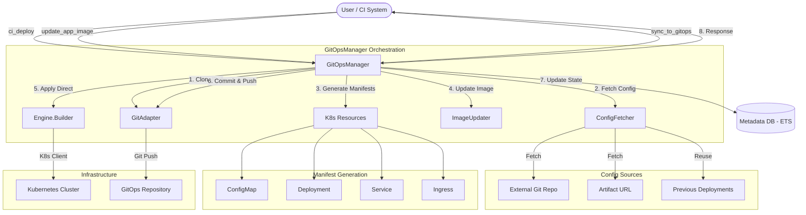

# Discovery GitOps Project Flow

This document outlines the architecture and operational flow of the Discovery project, specifically focusing on the GitOps management system.

## System Architecture

## Module Responsibilities

### Core Orchestration
- **`Discovery.GitOps.GitOpsManager`**: The central GenServer. It manages the local checkout of the GitOps repository (defaults to `/tmp/discovery-k8s`) and coordinates the lifecycle of a deployment.
- **`Discovery.GitOps.GitAdapter`**: A wrapper around shell commands for `git` operations. It handles cloning, branching, committing, pushing, and creating Pull Requests.

### Configuration & Manifests
- **`Discovery.GitOps.ConfigFetcher`**: Responsible for gathering `ConfigMap` data. It can pull from external Git repos, HTTP artifacts, or reuse the configuration from the most recent deployment of an app.
- **`Discovery.GitOps.ImageUpdater`**: Handles surgical updates to YAML manifests, specifically focusing on updating container image tags while preserving the rest of the file structure.
- **`Discovery.GitOps.RepoLayout`**: Encapsulates the logic for the GitOps repository's directory structure (e.g., whether to use `apps/` or environment-first layouts).
- **`Discovery.K8s.Resources.*`**: (ConfigMap, Deployment, Ingress, Service) These modules generate the actual Kubernetes manifests based on internal structs.

### Runtime & Infrastructure
- **`Discovery.Engine.Builder`**: Provides the connection to the Kubernetes API.
- **`Discovery.Utils`**: Handles UID generation, idempotency checks (via ETS), and metadata storage.

## The CI Deployment Workflow (`ci_deploy`)

The `ci_deploy` function follows a "Dual-Action" strategy to ensure both speed and consistency:

1.  **Preparation**: Generate a unique deployment ID (UID) and setup working directories.
2.  **Config Retrieval**: `ConfigFetcher` merges base configurations with environment-specific overrides.
3.  **Manifest Generation**: YAML files are written to the local temporary GitOps clone.
4.  **Direct Apply**: Manifests are applied immediately to the Kubernetes cluster via the K8s API. This ensures the deployment starts without waiting for GitOps sync cycles.
5.  **GitOps Persistence**: The changes are committed and pushed to the GitOps repository, ensuring the source of truth reflects the current state of the cluster.
6.  **Metadata Update**: The new endpoint is stored in an ETS table for immediate discovery by other services.
