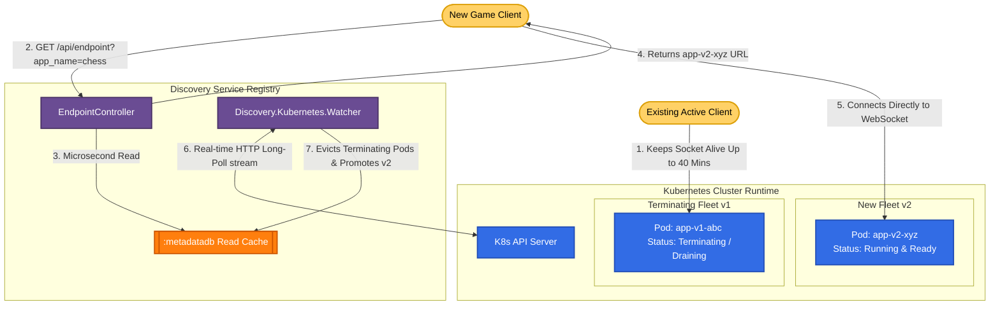

# Runtime Service Directory: Architecture, Dashboard & Usage Guide

Discovery is a high-speed, dynamic **Kubernetes Runtime Service Directory and Registry** designed specifically for session-based multiplayer game servers and long-lived stateful application pods (e.g. WebSockets, database connection poolers like Supavisor).

Instead of running a heavy, slow GitOps continuous deployment pipeline, Discovery delegates deployment rollouts and session-draining directly to native Kubernetes cluster primitives, acting strictly as a **sub-millisecond allocator and registry** for routing client connections to the freshest healthy pods.

---

## 🗺️ System Architecture & Flow Diagram

The following architecture diagram illustrates how Discovery monitors your Kubernetes cluster in real-time and routes clients to the correct pods while allowing older pods to safely drain active sessions:



---

## 🚀 How to Use the Discovery Service

### 1. Registering Apps for Tracking
Before the Watcher begins caching endpoints for your application, the application label must be registered in Discovery.

#### Via CLI (curl):
```bash
curl -X POST "http://localhost:4000/api/app" \
  -H "Content-Type: application/json" \
  -d '{"app_name": "chess"}'
```

---

### 2. Standard Kubernetes Deployment Setup
To deploy a game server that integrates with Discovery, configure your Deployment manifest to handle connection draining natively. 

New pods will surge immediately, while old pods enter a `Terminating` state but remain alive for up to 40 minutes (`2400` seconds) to let existing matches finish:

```yaml
apiVersion: apps/v1
kind: Deployment
metadata:
  name: chess-server
  namespace: discovery
  labels:
    app: chess # Must match the registered app_name
spec:
  replicas: 5
  strategy:
    type: RollingUpdate
    rollingUpdate:
      maxSurge: 100%      # Surge a complete duplicate fleet
      maxUnavailable: 0%  # Keep all old games running safely
  selector:
    matchLabels:
      app: chess
  template:
    metadata:
      labels:
        app: chess
    spec:
      terminationGracePeriodSeconds: 2400 # 40-minute draining window
      containers:
        - name: chess-container
          image: my-registry/chess:v2.0.0
          ports:
            - containerPort: 4000
          lifecycle:
            preStop:
              exec:
                # Let K8s fully update network endpoints before SIGTERM
                command: ["/bin/sh", "-c", "sleep 15"] 
```

---

### 3. Fetching the Fresh Routing Endpoint (Allocation)
When a game client starts up, it hits Discovery's client-facing allocation API. Discovery queries the in-memory ETS cache in **microseconds** and returns the connection details for the freshest, fully healthy, non-terminating pod:

```bash
curl -X GET "http://localhost:4000/api/endpoint?app_name=chess"
```

#### 📥 Expected JSON Response:
```json
{
  "endpoint": "chess.local/build-9f8e7d"
}
```

---

## 📊 How the Bridge Dashboard is Used

The visual **Bridge Dashboard** provides a real-time, read-only control panel showing your entire cluster's stateful application registry.

### 🏠 The App Directory Overview
1. Open your browser and navigate to `http://localhost:4000`.
2. The homepage lists all registered application boundaries.
3. For each application, you can instantly see:
   * **Name**: The registered application ID (e.g. `chess`).
   * **Deployments**: The number of active, non-terminating instances currently routing connections.
   * **Endpoint**: The public resolution API endpoint.
   * **Status**: Displays `healthy` (active pods found) or `empty` (no healthy pods matching the label are currently running).

### 🔍 Deep-Dive Allocation Inspector
Clicking on any application name opens the **App Inspector**:
* **Real-time Pod Activity Log**: Automatically displays active pod allocations.
* **Timestamp Inspector**: Displays exact creation and status modification times.
* **Metadata Viewer**: Shows container image tags (e.g. `v2.0.0`), replicas count, and individual routing path URLs (e.g. `chess.local/build-9f8e7d`).
* **Terminating Eviction**: Draining/terminating pods automatically vanish from the lists immediately, giving you a clean, real-time representation of where live clients are being routed.

---

## ⚙️ Detailed Technical Documentation of the Service

Discovery is engineered in **Elixir/OTP** to meet extreme high-speed and high-concurrency demands.

### 1. The Watcher Architecture (`Discovery.Kubernetes.Watcher`)
- **Event-Driven HTTP Long-Poll**: Instead of polling the K8s API periodically (which wastes cluster resources and introduces lag), the Watcher opens a single long-lived streaming connection using the Kubernetes Watch API:
  `GET /api/v1/namespaces/discovery/pods?watch=true&resourceVersion={rv}`
- **Sub-Millisecond Updates**: The Watcher receives stream chunks from the cluster the exact millisecond a pod transitions status.
- **Filtering Logic**: 
  - If a pod event contains `metadata.deletionTimestamp != nil`, the Watcher immediately **evicts** the pod from the cache.
  - If a pod is `Running` and its `Ready` condition is `True`, it is evaluated for caching.
  - The Watcher compares `creationTimestamp` metadata. Only the pod representing the **freshest version** of the deployment is promoted as the primary router target for incoming clients.

---

### 2. High-Speed Read Cache (`:metadatadb` ETS Table)
To avoid hitting heavy database servers or querying the Kubernetes control plane during client calls, Discovery utilizes an Erlang **ETS (Erlang Term Storage)** table:
- **`:set` Mode with `:public` access**: Allows any HTTP worker process handling a client request to read from the cache concurrently.
- **`read_concurrency: true`**: Optimizes the memory locks for high-frequency concurrent read actions.
- **Microsecond Speeds**: Querying `get_allocator(app_name)` executes in **microseconds**, bypassing external network and database calls completely.

---

### 3. Failover & Bootstrap Recovery Loop
If the Kubernetes stream drops due to a network partition or cluster upgrade, the Watcher maintains robust self-healing:
1. Catches disconnect events or HTTP timeout chunks.
2. Triggers a **Bootstrap** sequence:
   * Performs a standard `LIST` operation to fetch the complete active cluster state.
   * Re-seeds the `:metadatadb` cache with the freshest, healthy pods.
3. Retrieves the latest `resourceVersion` from the list metadata.
4. Spawns a new long-lived, streaming `WATCH` connection starting exactly at that version, ensuring **zero state loss and zero routing gaps** during cluster migrations!
