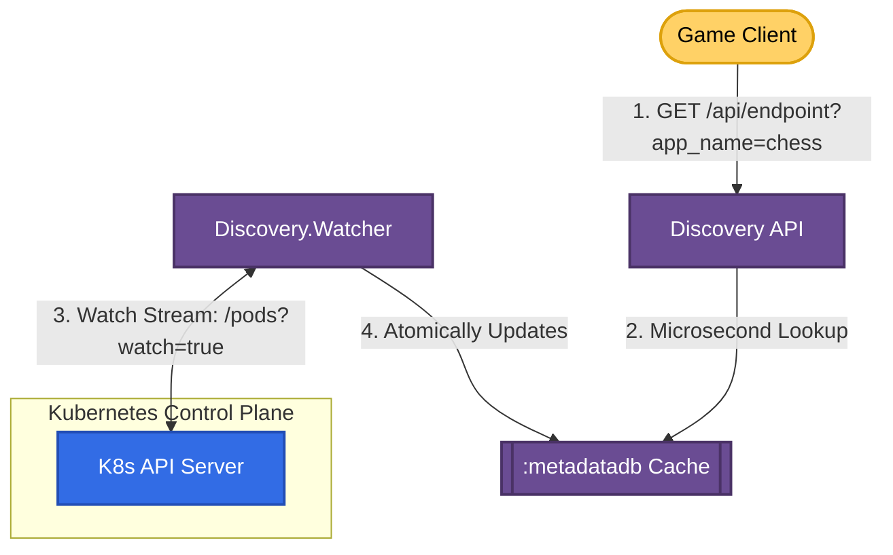

# Discovery: System Architecture & Walkthrough Guide

This walkthrough guide details the architecture, design principles, and operational instructions for **Discovery**, a high-throughput, event-driven dynamic service registry and routing allocator for stateful multiplayer game servers and real-time pods.

---

## ⚡ 1. The Core Architecture

Unlike stateless HTTP apps, stateful apps (using WebSockets, long-lived TCP, or UDP connections) cannot be arbitrarily killed or misrouted during rolling deployments without terminating active user sessions. 

Discovery separates the **deployment plane** from the **routing plane** by streaming events directly from the Kubernetes control plane in real-time, eliminating the need for periodic polling or custom orchestration layers.



### Key Subsystems:
1. **`Discovery.Kubernetes.Watcher`**:
   - Establishes a persistent, streaming connection to the Kubernetes Watch API (`/api/v1/namespaces/{namespace}/pods?watch=true`).
   - Receives push notifications from K8s the exact millisecond a pod status changes (e.g. `ADDED`, `MODIFIED`, `DELETED`).
   - Filters out draining pods (`metadata.deletionTimestamp != nil`) and only promotes the **freshest, fully ready** pod IP and suffix path to the memory cache.
2. **In-Memory Cache (ETS)**:
   - Stores the active route under key `app_name` and the list of all running pods under key `{:all_pods, app_name}` in the `:metadatadb` ETS table.
   - Lookups are resolved in microseconds using `read_concurrency: true`.
3. **`Discovery.Kubernetes.Reader`**:
   - Serves client route allocation requests (`GET /api/endpoint?app_name=...`) directly from ETS, bypassing K8s API overhead.

---

## ⚡ 2. Zero-Downtime Connection Draining

To update a stateful application with zero player disconnects, we use **Connection Draining**. When a new version is deployed:
1. Kubernetes starts new pods.
2. Once the new pods pass readiness probes, Discovery immediately promotes the new pod's suffix path (e.g. `/xc8rz`) to active routing. Any new client request to Discovery receives this suffix.
3. The old pods enter a `Terminating` state, but **do not exit immediately**. Instead, they gracefully drain existing connections over a defined grace period (e.g. 40 minutes).

### Draining Process in Stateful Applications:

```
[K8s Rollout triggered]
          │
          ▼
┌───────────────────────────────┐
│     New Pods Surged (v2)      │
└──────────────┬────────────────┘
               │
               ▼ (Passes readiness probe)
┌───────────────────────────────┐
│ Discovery promotes v2 Suffix  │  ──► (All new connections route to v2)
└──────────────┬────────────────┘
               │
               ▼ (K8s deletes old v1 pods)
┌───────────────────────────────┐
│   v1 Pods enter Terminating   │
└──────────────┬────────────────┘
               │
               ▼ (Internal 15s routing propagation delay)
┌───────────────────────────────┐
│ v1 Server stops new listeners  │
└──────────────┬────────────────┘
               │
               ▼ (Keeps existing WebSocket connections open)
┌───────────────────────────────┐
│ v1 Waits for activeWebsockets │
│ to drop to 0 or 40min timeout │
└───────────────────────────────┘
```

---

## ⚡ 3. Operational Reference Blueprints

### ☸️ Stateful Pod Deployment Manifest (`deployment.yaml`)
Configure your deployment strategy with `maxSurge: 100%` and `maxUnavailable: 0%` to ensure new capacity is fully online before old capacity is terminated, and set a large `terminationGracePeriodSeconds`:

```yaml
apiVersion: apps/v1
kind: Deployment
metadata:
  name: my-stateful-app
  namespace: discovery
spec:
  replicas: 2
  strategy:
    type: RollingUpdate
    rollingUpdate:
      maxSurge: 100%
      maxUnavailable: 0%
  template:
    metadata:
      labels:
        app: my-stateful-app
    spec:
      terminationGracePeriodSeconds: 2400 # Allow up to 40 minutes to drain
      containers:
      - name: my-stateful-app
        image: my-registry/my-app:v1.0.0
        ports:
        - containerPort: 8000
```

### 🔇 Application Signal Interception & Draining (Go Code Example)
Because upgraded WebSocket connections are hijacked by the application, standard web server graceful shutdowns (like `http.Server.Shutdown`) do not track or wait for them. The application must track them using an atomic counter and intercept the `SIGTERM` signal:

```go
package main

import (
	"context"
	"log"
	"net/http"
	"os"
	"os/signal"
	"sync/atomic"
	"syscall"
	"time"
)

var activeWebsockets int64

func handleWebSocket(w http.ResponseWriter, r *http.Request) {
	// ... upgrade connection ...
	atomic.AddInt64(&activeWebsockets, 1)
	defer atomic.AddInt64(&activeWebsockets, -1)
	// ... process websocket ...
}

func main() {
	server := &http.Server{Addr: ":8000"}

	shutdownChan := make(chan os.Signal, 1)
	signal.Notify(shutdownChan, syscall.SIGINT, syscall.SIGTERM)

	go func() {
		if err := server.ListenAndServe(); err != http.ErrServerClosed {
			log.Fatalf("Server ListenAndServe failed: %v", err)
		}
	}()

	// Wait for OS shutdown signal
	sig := <-shutdownChan
	
	// 1. Sleep to allow Kubernetes Service & Ingress routing tables to propagate
	log.Printf("Received signal %v. Sleeping 15s...", sig)
	time.Sleep(15 * time.Second)

	// 2. Shut down listener to reject any new TCP connections
	log.Println("Shutting down listener...")
	ctx, cancel := context.WithTimeout(context.Background(), 10*time.Second)
	defer cancel()
	server.Shutdown(ctx)

	// 3. Wait for WebSocket connections to drain naturally
	drainTimeout := time.After(40 * time.Minute)
	ticker := time.NewTicker(1 * time.Second)
	defer ticker.Stop()

	for {
		select {
		case <-drainTimeout:
			log.Println("Grace period expired. Forcefully exiting.")
			return
		case <-ticker.C:
			if atomic.LoadInt64(&activeWebsockets) == 0 {
				log.Println("All connections drained. Exiting clean.")
				return
			}
		}
	}
}
```

---

## ⚡ 4. Visualizing Deployments in real-time

The **Bridge Dashboard** (`http://discovery.localhost:8080`) provides a real-time visual representation of your deployment topologies:

* **Sleek Dark Design**: Fits modern developer environments, reducing eye strain.
* **Network Deployment Graph**:
  - Displays the **Ingress Router** as the entrypoint.
  - Generates visual connector nodes linking the Ingress directly to the active replica set.
  - Highlights the **Active Promoted Route** node in vibrant pulsing emerald green with an `ACTIVE` tag.
  - Displays **Draining/Standby Pods** with grey status tags, signifying they are gracefully serving legacy clients offline while refusing new entries.
